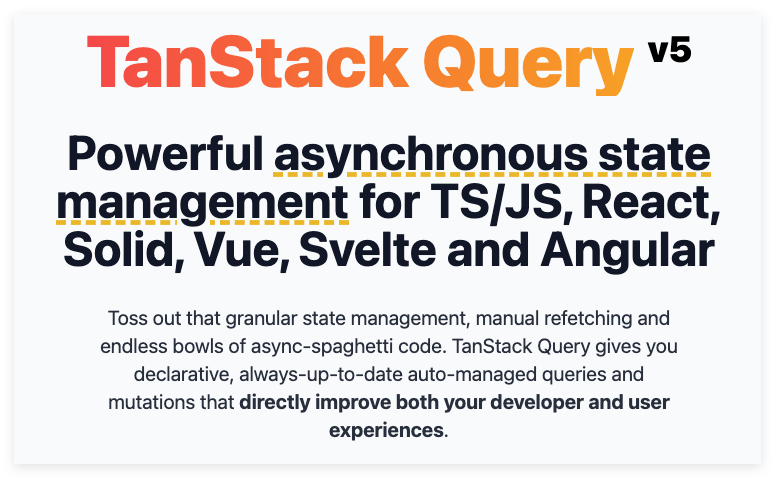
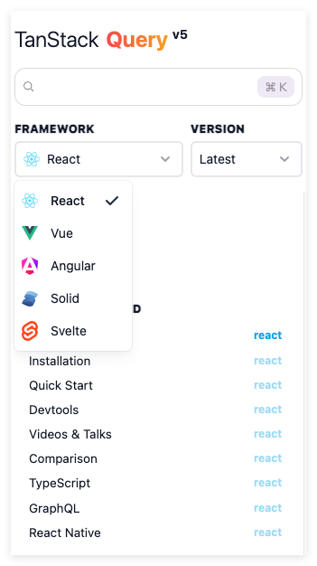

[React-Query](https://tanstack.com/query/latest) 是一个用于在 web 应用中获取、缓存、同步和更新服务器状态的库。它简化了数据获取过程，使开发者能够专注于业务逻辑，而无需处理繁琐的状态管理。它自动管理请求状态，包括加载、错误处理和数据缓存，极大提高了开发效率。内置的缓存机制不仅减少了网络请求，还提升了应用性能和用户体验。还支持复杂用例，如分页和实时数据获取。另外，它能与现代框架（如 React 和 Vue）及其他状态管理库（如 Redux 和 Zustand）无缝集成，增强了灵活性。

React-Query 通过使用查询键来标识不同接口返回的数据，而查询函数就是我们请求后端接口的函数。React-Query 中的查询是对异步数据源的声明性依赖，它与唯一键绑定。查询可以与任何基于 Promise 的方法一起使用（包括 GET 和 POST 方法）来从服务器获取数据。

## 1. 什么是 TanStack Query？
### 背景

按照官方的说法：大多数核心的 Web 框架缺乏统一的方式来获取或更新数据；在此背景下，就有了 React Query 的雏形。

### 主要功能和特点

React Query 是用来管理接口请求的，包括增删改查所有类型的接口。管理的内容包括响应数据和请求状态，可以让你少些很多样板代码。

#### 功能

- 数据获取和缓存：自动管理异步数据的获取和缓存，减少不必要的请求。
- 实时数据更新：支持实时数据更新，通过轮询或 WebSocket 等机制获取最新数据。
- 自动重新获取：当网络恢复或窗口重新获得焦点时，自动重新获取数据。
- 分页和无限加载：支持分页和无限滚动，简化处理大数据集的过程。
- 请求重试：在请求失败时自动重试，增加请求的成功率。
- 错误处理：提供简单的错误处理机制，便于捕获和处理请求错误。
- 查询和变更的分离：明确区分数据获取（查询）和数据变更（变更），使代码更清晰。
- 灵活的查询：支持复杂的查询参数，可以轻松管理不同的数据请求。
- DevTools：提供开发者工具，便于调试和监控数据状态。
- ……

#### 特点

开箱即用、无需配置。

### 与 React Query 的关系

React Query 是 v4 以前的叫法，从 v4 起就叫 TanStack Query。之所以改名字，是因为这个团队这套方案推广到除 React 之外的其他框架中去。到目前（2024年10月）最新的 v5 版本已经支持 React、Vue、Angular、Solid、Svelte 5 大框架。



## 2. 快速入门

TanStack Query 官方也提供了一个使用 react-query 获取 React Query GitHub 统计信息的简单示例；可以[在 StackBlitz 中打开](https://stackblitz.com/github/TanStack/query/tree/main/examples/react/simple)。核心代码如下：

```jsx
import React from 'react'
import ReactDOM from 'react-dom/client'
import {
  QueryClient,
  QueryClientProvider,
  useQuery,
} from '@tanstack/react-query'
import { ReactQueryDevtools } from '@tanstack/react-query-devtools'

// 创建实例
const queryClient = new QueryClient()

export default function App() {
  return (
    <QueryClientProvider client={queryClient}>
      <ReactQueryDevtools />
      <Example />
    </QueryClientProvider>
  )
}

function Example() {
  // 发请求
  const { isPending, error, data, isFetching } = useQuery({
    queryKey: ['repoData'],
    queryFn: async () => {
      const response = await fetch(
        'https://api.github.com/repos/TanStack/query',
      )
      return await response.json()
    },
  })

  // 处理请求正在加载中的状态
  if (isPending) return 'Loading...'

  // 处理请求出错的状态
  if (error) return 'An error has occurred: ' + error.message

  return (
    <div>
      <h1>{data.full_name}</h1>
      <p>{data.description}</p>
      <strong>👀 {data.subscribers_count}</strong>{' '}
      <strong>✨ {data.stargazers_count}</strong>{' '}
      <strong>🍴 {data.forks_count}</strong>
      <div>{isFetching ? 'Updating...' : ''}</div>
    </div>
  )
}

const rootElement = document.getElementById('root') as HTMLElement
ReactDOM.createRoot(rootElement).render(<App />)
```


安装步骤
npm 或 yarn 命令
基本配置
提供 QueryClient
在应用中使用 QueryClientProvider

## 3. 基本用法
创建第一个查询
使用 useQuery 钩子
示例代码
创建变更请求
使用 useMutation 钩子
示例代码

## 4. 查询状态管理
查询状态的不同状态（加载、成功、错误）
如何处理状态和错误
使用 isLoading 和 isError 属性
## 5. 数据缓存与更新
数据缓存机制
如何手动更新缓存
使用 queryClient.invalidateQueries 方法
## 6. 处理分页和无限滚动
实现分页查询
实现无限滚动
示例代码
## 7. 订阅与实时数据
如何使用 WebSocket 或其他实时数据源
示例代码
## 8. 结合其他状态管理库
在 Redux 或 Zustand 中使用 TanStack Query
示例代码
## 9. 性能优化
使用 staleTime 和 cacheTime 来优化性能
如何避免不必要的请求
## 10. 常见问题
TanStack Query 的常见误区
常见错误及其解决方法