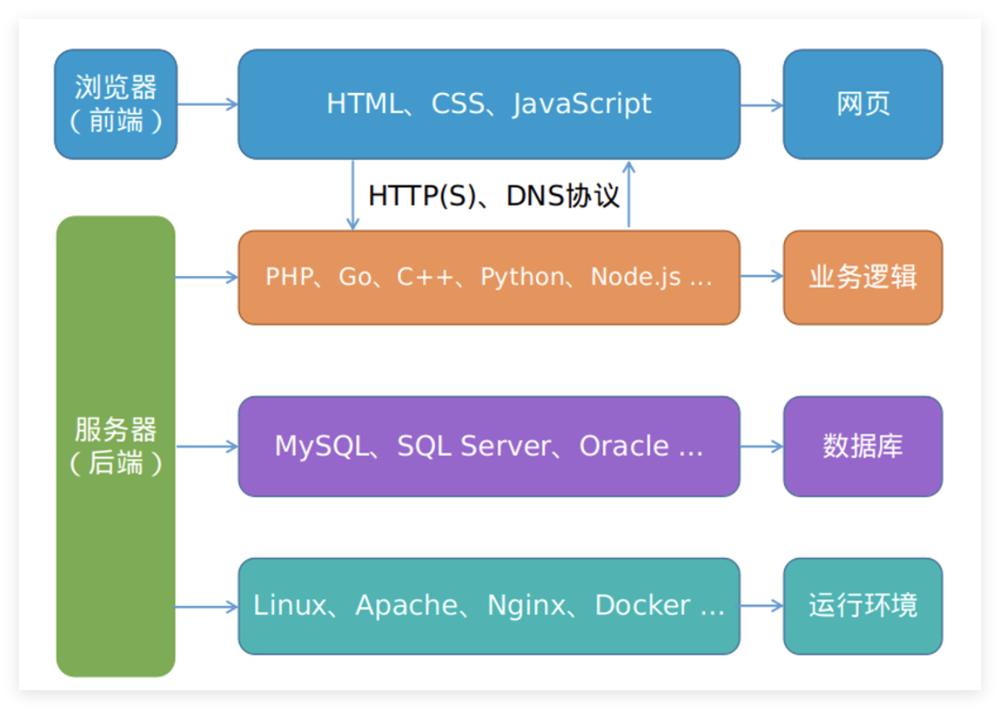

## Web 安全

### 黑帽黑客

黑帽黑客会为了个人利益而从事恶意活动，例如窃取敏感数据、破坏系统或实施欺诈。这些黑客经常利用安全漏洞未经授权访问系统和数据。他们的行为会给受害者造成重大经济损失、声誉损害和法律后果。

黑帽黑客通常以地下黑客社区或有组织犯罪网络的形式活动。他们使用恶意软件、勒索软件和网络钓鱼等工具来实施攻击。全球执法机构都在努力追踪和逮捕黑帽黑客，但由于他们采用复杂的匿名技术，因此行动往往很难被抓获。
 

### 白帽黑客

白帽黑客是网络安全专业人士，他们利用自己的技能来识别和修复安全漏洞，帮助保护系统和数据免受攻击。他们通常受雇于组织或作为独立顾问，进行渗透测试、漏洞评估和安全审计，以改善网络安全防御。

与黑帽黑客不同，白帽黑客拥有合法授权，受道德标准约束，并经常与安全团队合作制定和实施安全措施。
 

### 灰帽黑客

灰帽黑客介于黑帽黑客和白帽黑客之间。虽然他们可能像黑帽黑客一样利用安全漏洞，但他们的意图不一定是恶意的。他们经常在未经授权的情况下识别和利用漏洞，但通常不会利用这些信息谋取私利。相反，他们可能会通知受影响的组织，有时希望获得奖励或认可。

尽管灰帽黑客可以帮助发现可能被忽视的安全漏洞，但它引发了道德和法律问题。未经许可利用系统，即使是出于善意，仍然可能造成损害或意想不到的后果。

## 哪些设备最容易受到黑客攻击？

### 计算机

由于计算机使用广泛且存储着大量宝贵数据，因此它仍然是黑客的主要目标之一。操作系统、软件应用程序和网络协议中的漏洞可被利用来获取未经授权的访问。常见的攻击媒介包括恶意软件、网络钓鱼电子邮件以及利用过时或未打补丁的软件。

黑客通常既针对个人用户，也针对企业网络。个人计算机可能被入侵，窃取敏感信息，例如银行凭证或个人身份信息。相比之下，入侵企业系统可能导致大规模数据泄露、勒索软件攻击和重大财务损失。
 

### 移动设备

移动设备（包括智能手机和平板电脑）因其无处不在且保存着宝贵的数据而日益成为黑客的目标。这些设备容易受到各种形式的攻击，包括恶意软件、网络钓鱼和不安全的应用程序安装。移动银行和移动支付的快速普及进一步增加了风险。

恶意应用程序、不安全的 Wi-Fi 网络和操作系统漏洞可能会危害移动设备安全。用户通常不太注意更新移动设备上的软件，这使他们成为有利可图的目标。此外，移动设备与商业环境的集成引发了人们对企业数据安全的担忧。
 

### 物联网设备

物联网 (IoT) 设备（例如智能家电、可穿戴设备和联网传感器）带来了独特的安全挑战。许多物联网设备缺乏强大的安全功能，因此很容易成为黑客的目标。常见问题包括默认密码、不安全的通信协议和更新机制不足。

入侵物联网设备可能导致各种恶意活动，从未经授权的监视到破坏服务。被入侵的物联网设备还可以作为大型网络的入口点，对整个网络安全构成风险。
 

### 网络路由器

网络路由器是任何互联网连接环境的关键组件，因此成为黑客的主要目标。入侵路由器可以让攻击者控制网络流量，从而实现数据拦截、重定向和恶意内容注入。默认密码和过时的固件是常见的漏洞。

一旦路由器被入侵，它就会被用来对连接的设备发起进一步的攻击，或成为僵尸网络的一部分。确保路由器安全需要定期更新固件、使用强密码以及禁用不必要的服务。

## 常见的黑客类型和技术

### 僵尸网络

僵尸网络由受感染的计算机网络组成，这些计算机被称为机器人或僵尸，由黑客控制。这些网络可用于各种恶意活动，例如发起分布式拒绝服务 (DDoS) 攻击、发送垃圾邮件和分发恶意软件。僵尸网络所有者或机器人控制者可以同时控制数千甚至数百万台受感染的设备。

僵尸网络的创建和维护通常不会被受感染设备的用户注意到。它们利用软件和操作系统中的漏洞来获取控制权。现代僵尸网络使用复杂的技术来保持隐蔽性并抵御检测。
 

### 浏览器劫持

浏览器劫持是指未经用户同意控制网络浏览器并操纵其设置。这种形式的黑客攻击会将用户重定向到恶意网站、更改搜索结果并安装不需要的工具栏或扩展程序。劫持可以通过恶意软件、受感染的网站或驱动下载等欺骗性做法发生。

浏览器劫持的后果包括令人烦恼的干扰和严重的安全风险，包括身份盗窃和财务损失。用户可以通过保持浏览器更新、使用信誉良好的防病毒软件以及避免可疑链接和下载来保护自己。
 

### 拒绝服务 (DDoS) 攻击

分布式拒绝服务 (DDoS) 攻击旨在通过过量流量压垮目标系统、网络或服务，使合法用户无法访问。攻击者使用僵尸网络或其他手段生成大量流量并将其导向目标，从而造成中断或完全服务中断。

受到 DDoS 攻击影响的组织可能会遭受重大财务损失、声誉受损和运营中断。缓解措施包括部署网络安全措施、流量过滤和准备好响应计划。
 

### 勒索软件

勒索软件是一种恶意软件，它会加密受害者的文件或锁定其系统，要求支付赎金才能恢复访问权限。勒索软件攻击可以针对个人、企业和关键基础设施，造成严重破坏和经济损失。攻击者通常要求以比特币等加密货币支付。

受害者面临艰难的选择：支付赎金且无法保证数据恢复，或者忍受数据丢失和潜在的停机。预防勒索软件攻击需要定期备份数据、更新安全软件和用户意识培训。
 

### Rootkit

Rootkit 是一种恶意软件，旨在通过为黑客提供特权访问来隐藏系统中其他恶意软件的存在。它们可以驻留在操作系统、固件或应用软件中，因此很难检测到。Rootkit 使攻击者能够对系统保持持久的、未经授权的控制。

Rootkit 的安装方法经常利用软件漏洞或社会工程学技巧。一旦安装，Rootkit 便可进行各种恶意活动，包括数据窃取和系统操纵。
 

### 特洛伊木马

特洛伊木马是伪装成合法软件的恶意程序。它们会诱骗用户安装，从而导致未经授权的访问、数据被盗或进一步安装恶意软件。特洛伊木马可以嵌入看似无害的应用程序、电子邮件附件或误导性的网站链接中。

一旦激活，木马便会助长各种有害活动，例如监视用户活动、窃取凭据或创建后门以供将来访问。防范木马需要对软件安装保持警惕、定期进行系统扫描以及使用威胁检测工具。
 

### 病毒

病毒是自我复制的恶意软件，会附着在合法文件或程序上，并在这些文件共享时传播。病毒在执行时会损坏或删除数据、破坏系统运行或危害安全。它们通常通过电子邮件附件、受感染的软件或可移动媒体传播。

病毒的影响各不相同，从轻微破坏到严重数据丢失和系统损坏。预防病毒感染包括使用防病毒软件、避免可疑下载以及保持系统更新。
 

### 蠕虫

蠕虫是独立的恶意软件，可以独立复制和传播，无需附加到其他文件或程序。它们利用网络漏洞在连接的系统之间传播，通常会通过消耗带宽和使服务器过载造成大面积破坏。

与病毒不同，蠕虫不需要用户交互即可传播。它们可以通过启动窃取数据、安装其他恶意软件或破坏网络运行的有效载荷造成重大危害。

## 如何防止恶意黑客攻击

### 保持系统和软件为最新版本

定期更新系统和软件对于防止黑客攻击至关重要。软件开发人员经常发布更新和补丁来修复黑客可能利用的安全漏洞。延迟更新可能会使系统暴露于已知威胁，从而增加遭受攻击的风险。

尽可能自动更新可确保系统始终受到最新安全修复程序的保护。此外，组织应监控关键补丁并及时部署。
 

### 强密码和多因素身份验证

创建强密码并使用多因素身份验证 (MFA) 可显著增强安全性。强密码应复杂、独特且定期更新。组合字母、数字和特殊字符可使密码难以猜测或破解。

MFA 通过要求进行额外验证（例如将代码发送到移动设备以及密码）增加了一层额外的安全性。即使密码被泄露，这种方法也能大大降低未经授权访问的风险。
 

### 利用反恶意软件保护

反恶意软件对于检测和删除系统中的恶意软件至关重要。它提供实时保护、监控可疑活动并阻止潜在威胁。定期扫描可确保识别并消除任何潜伏恶意软件。

选择信誉良好的反恶意软件解决方案并保持更新可确保系统具有针对新出现的威胁的最新保护。
 

### 加密静态和传输中的数据

加密数据有助于保护敏感信息在存储（静态）和传输（传输中）期间免受未经授权的访问。加密将数据转换为没有正确解密密钥就无法读取的形式，从而保护数据免受黑客和窃听者的攻击。

利用强大的加密标准（例如静态数据的 AES 和传输数据的 TLS）可确保强大的安全性。定期审查和更新加密实践可使数据保护与不断发展的网络安全威胁保持一致。
 

### 使用安全备份实践

实施安全备份实践对于数据恢复和防范勒索软件和其他威胁至关重要。定期备份可确保在数据丢失、损坏或受到攻击时能够恢复数据。确保备份加密并安全存储可进一步保护其免受未经授权的访问。

异地或基于云的备份可保护数据免受本地灾难或泄露的影响，从而提供额外的安全性。测试备份和恢复流程可确保它们在需要时有效运行。
 

### 制定事件响应计划

制定事件响应计划可使组织快速有效地应对安全漏洞或网络攻击。该计划应概述识别、遏制、消除和恢复事件的明确程序。明确的计划有助于最大限度地减少损害并迅速恢复正常运营。

定期演练和更新事件响应计划可确保对新出现的威胁做好准备。让主要利益相关者参与并在事件发生期间保持沟通可确保协调一致。
 

### 管理第三方风险

管理第三方风险可确保合作伙伴、供应商和服务提供商遵守安全标准。第三方关系可能会带来漏洞，因此定期评估和监控其安全实践至关重要。

建立明确的安全要求并定期进行审计有助于降低与第三方相关的风险。合同应包括涉及安全责任和事件响应的条款。
 

### 对员工进行网络安全培训

员工培训和意识计划对于防止黑客攻击至关重要。教育员工了解网络安全威胁、安全实践和事件报告有助于减少人为错误并增强组织的防御能力。

定期的培训课程、模拟和有关新兴威胁的更新可让员工了解最新情况并保持警惕。鼓励安全意识文化可确保每个人都参与维护网络安全。

from：https://www.hackerone.com/knowledge-center/what-hacking-black-hat-white-hat-blue-hat-and-more

通常所说的 Web 安全，是指 Web 应用安全，即网站安全，也包含仅提供后端 CGI 服务的应用（供移动 App 调用的，无直接的前端网页），可以简单地分为前端和后端，如下图所示：

平常行业内所说的二进制安全，通常是指内存破坏漏洞、逆向工程、病毒对抗等涉及二进制数据分析的技术领域。虽然浏览器、Linux 系统等也是 Web 领域中的一个环节，

OWASP Top 10:

- 注入：SQL、NoSQL 数据库注入，还有命令注入和 LDAP 注入等。

- 失效的身份认证和会话管理：比如攻击者破解密码、窃取密钥、会话令牌或其他漏洞去冒充他人的身份。

- 跨站脚本（XSS）：XSS 允许攻击者在受害者的浏览器上执行恶意脚本，从而劫持用户会话、钓鱼欺骗等等。

- 失效的访问控制：比如越权访问其他用户的个人资料、查看敏感文件、篡改数据等。

- 安全配置错误：比如服务器的不安全配置，导致敏感信息泄露。

- 敏感信息泄露：比如账号密码未加密存储、敏感数据传输时未加密保护，最终造成数据泄露。

- 攻击检测与防护不足：比如 WAF、主机入侵检测等防御系统部署不全，这块偏向漏洞防御本身。

- 跨站请求伪造（CSRF）：攻击者诱使其他登录用户访问恶意站点，以冒用对方的身份执行一些敏感操作。

使用含有已知漏洞的组件：比如一些第三方的开源库、框架等，尤其是已公开漏洞的旧版本，比如名燥一声的 Struts2 漏洞，因频繁出现漏洞被许多开发者弃用。

未受有效保护的 API：比如浏览器和移动 App 中的 JavaScript API，常常因其提供的特殊功能未受有效保护而被滥用，造成不同等级的危害程度。

## 白帽子最喜欢用什么安全工具?

### Burp Suite

Burp Suite 分免费的社区版、收费的专业版和企业版。社区版主要是一些代理抓包改包的基本功能，专业版则包含漏洞扫描器、插件商店、Burp Instruder（比如用来暴力破解账号）等功能。

专业版一年收费 399 美元，按当前汇率算，相当于 2637 元，也并不便宜；企业版更贵，要 3999 美元（相当于 26435 元），主要增加了一些定期循环漏洞扫描和 CI 持续集成功能，具有更好的扩展性。

